<div align="center">

# 🌐 VulnX Security Scanner

### **Real-time Port Analysis • Service Fingerprinting • Live Threat Intelligence**

A high-performance Python + Flask based security scanner that performs real-time port scanning, banner grabbing, severity scoring, threat mapping, and subdomain enumeration — all via a modern dark dashboard UI.

[](https://www.python.org/)
[](https://flask.palletsprojects.com/)
[](https://github.com/shubhushubhu99/vulnXscanner)
[](https://vulnx-scanner-production.up.railway.app/)
[](LICENSE)

### 🌎 [Live Demo](https://vulnx-scanner-production.up.railway.app/)

</div>

---

## 🚀 About VulnX

VulnX Scanner is a professional-grade **cybersecurity auditing tool** built using **Python + Flask**. It performs:

- ✔ Port scanning (IPv4 & IPv6)
- ✔ Banner grabbing
- ✔ Service detection
- ✔ Severity scoring
- ✔ Threat assessment
- ✔ AI-based analysis (Google Gemini)
- ✔ Subdomain enumeration
- ✔ PDF report generation
- ✔ Fully responsive UI

**Designed for:** Security analysts, penetration testers, red teams, researchers, and students.

---

## 🏗️ System Architecture

### High-Level Architecture Diagram

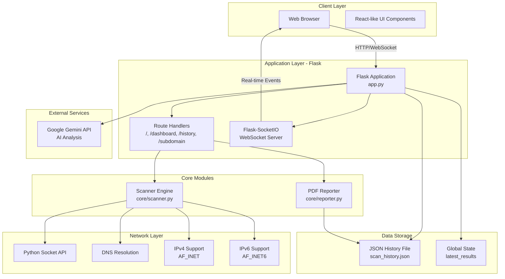
```mermaid
graph TB
    subgraph "Client Layer"
        Browser[Web Browser]
        UI[React-like UI Components]
    end
    
    subgraph "Application Layer - Flask"
        App[Flask Application<br/>app.py]
        Routes[Route Handlers<br/>/, /dashboard, /history, /subdomain]
        SocketIO[Flask-SocketIO<br/>WebSocket Server]
    end
    
    subgraph "Core Modules"
        Scanner[Scanner Engine<br/>core/scanner.py]
        Reporter[PDF Reporter<br/>core/reporter.py]
    end
    
    subgraph "Network Layer"
        Socket[Python Socket API]
        DNS[DNS Resolution]
        IPv4[IPv4 Support<br/>AF_INET]
        IPv6[IPv6 Support<br/>AF_INET6]
    end
    
    subgraph "External Services"
        Gemini[Google Gemini API<br/>AI Analysis]
    end
    
    subgraph "Data Storage"
        History[JSON History File<br/>scan_history.json]
        State[Global State<br/>latest_results]
    end
    
    Browser -->|HTTP/WebSocket| App
    App --> Routes
    App --> SocketIO
    Routes --> Scanner
    Routes --> Reporter
    SocketIO -->|Real-time Events| Browser
    Scanner --> Socket
    Scanner --> DNS
    Scanner --> IPv4
    Scanner --> IPv6
    App --> Gemini
    App --> History
    App --> State
    Reporter --> History
```

---

## 🔄 Complete Scanning Workflow

### Detailed Port Scanning Process

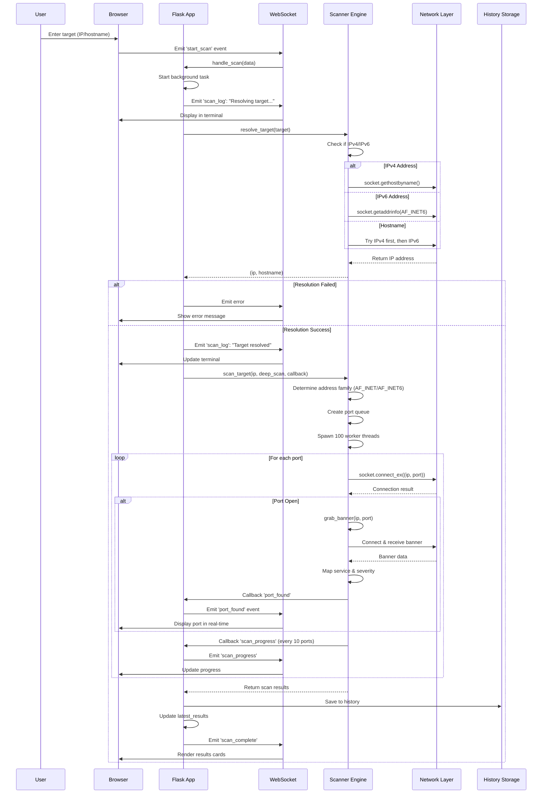
```mermaid
sequenceDiagram
    participant User
    participant Browser
    participant Flask as Flask App
    participant SocketIO as WebSocket
    participant Scanner as Scanner Engine
    participant Network as Network Layer
    participant Storage as History Storage

    User->>Browser: Enter target (IP/hostname)
    Browser->>SocketIO: Emit 'start_scan' event
    SocketIO->>Flask: handle_scan(data)
    Flask->>Flask: Start background task
    
    Flask->>SocketIO: Emit 'scan_log': "Resolving target..."
    SocketIO->>Browser: Display in terminal
    
    Flask->>Scanner: resolve_target(target)
    Scanner->>Scanner: Check if IPv4/IPv6
    alt IPv4 Address
        Scanner->>Network: socket.gethostbyname()
    else IPv6 Address
        Scanner->>Network: socket.getaddrinfo(AF_INET6)
    else Hostname
        Scanner->>Network: Try IPv4 first, then IPv6
    end
    
    Network-->>Scanner: Return IP address
    Scanner-->>Flask: (ip, hostname)
    
    alt Resolution Failed
        Flask->>SocketIO: Emit error
        SocketIO->>Browser: Show error message
    else Resolution Success
        Flask->>SocketIO: Emit 'scan_log': "Target resolved"
        SocketIO->>Browser: Update terminal
        
        Flask->>Scanner: scan_target(ip, deep_scan, callback)
        Scanner->>Scanner: Determine address family (AF_INET/AF_INET6)
        Scanner->>Scanner: Create port queue
        Scanner->>Scanner: Spawn 100 worker threads
        
        loop For each port
            Scanner->>Network: socket.connect_ex((ip, port))
            Network-->>Scanner: Connection result
            
            alt Port Open
                Scanner->>Scanner: grab_banner(ip, port)
                Scanner->>Network: Connect & receive banner
                Network-->>Scanner: Banner data
                Scanner->>Scanner: Map service & severity
                Scanner->>Flask: Callback 'port_found'
                Flask->>SocketIO: Emit 'port_found' event
                SocketIO->>Browser: Display port in real-time
            end
            
            Scanner->>Flask: Callback 'scan_progress' (every 10 ports)
            Flask->>SocketIO: Emit 'scan_progress'
            SocketIO->>Browser: Update progress
        end
        
        Scanner-->>Flask: Return scan results
        Flask->>Storage: Save to history
        Flask->>Flask: Update latest_results
        Flask->>SocketIO: Emit 'scan_complete'
        SocketIO->>Browser: Render results cards
    end
```

---

## 🌐 IPv4/IPv6 Detection & Resolution Flow

### Address Family Detection Process

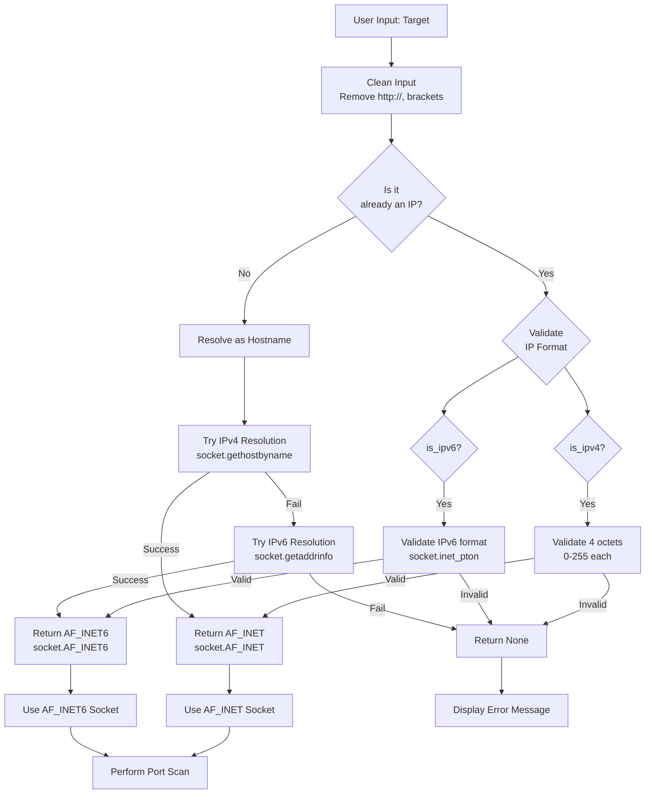
```mermaid
flowchart TD
    Start[User Input: Target] --> Clean[Clean Input<br/>Remove http://, brackets]
    Clean --> CheckIP{Is it<br/>already an IP?}
    
    CheckIP -->|Yes| ValidateIP{Validate<br/>IP Format}
    CheckIP -->|No| ResolveDNS[Resolve as Hostname]
    
    ValidateIP --> CheckIPv4{is_ipv4?}
    ValidateIP --> CheckIPv6{is_ipv6?}
    
    CheckIPv4 -->|Yes| IPv4Valid[Validate 4 octets<br/>0-255 each]
    CheckIPv6 -->|Yes| IPv6Valid[Validate IPv6 format<br/>socket.inet_pton]
    
    IPv4Valid -->|Valid| ReturnIPv4[Return AF_INET<br/>socket.AF_INET]
    IPv4Valid -->|Invalid| Error[Return None]
    
    IPv6Valid -->|Valid| ReturnIPv6[Return AF_INET6<br/>socket.AF_INET6]
    IPv6Valid -->|Invalid| Error
    
    ResolveDNS --> TryIPv4[Try IPv4 Resolution<br/>socket.gethostbyname]
    TryIPv4 -->|Success| ReturnIPv4
    TryIPv4 -->|Fail| TryIPv6[Try IPv6 Resolution<br/>socket.getaddrinfo]
    TryIPv6 -->|Success| ReturnIPv6
    TryIPv6 -->|Fail| Error
    
    ReturnIPv4 --> UseIPv4[Use AF_INET Socket]
    ReturnIPv6 --> UseIPv6[Use AF_INET6 Socket]
    
    UseIPv4 --> Scan[Perform Port Scan]
    UseIPv6 --> Scan
    
    Error --> FailMsg[Display Error Message]
```

---

## 🔍 Port Scanning Engine Architecture

### Multi-threaded Scanning Process

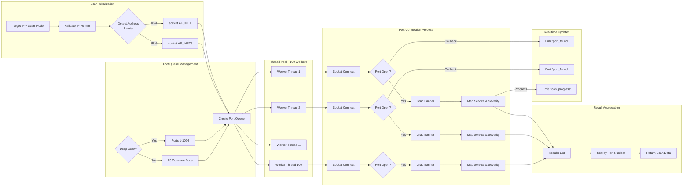
```mermaid
graph LR
    subgraph "Scan Initialization"
        Input[Target IP + Scan Mode] --> Validate[Validate IP Format]
        Validate --> Family{Detect Address<br/>Family}
        Family -->|IPv4| AF_INET[socket.AF_INET]
        Family -->|IPv6| AF_INET6[socket.AF_INET6]
    end
    
    subgraph "Port Queue Management"
        AF_INET --> PortQueue[Create Port Queue]
        AF_INET6 --> PortQueue
        DeepScan{Deep Scan?} -->|Yes| Ports1024[Ports 1-1024]
        DeepScan -->|No| CommonPorts[23 Common Ports]
        Ports1024 --> PortQueue
        CommonPorts --> PortQueue
    end
    
    subgraph "Thread Pool - 100 Workers"
        PortQueue --> Worker1[Worker Thread 1]
        PortQueue --> Worker2[Worker Thread 2]
        PortQueue --> Worker3[Worker Thread ...]
        PortQueue --> WorkerN[Worker Thread 100]
    end
    
    subgraph "Port Connection Process"
        Worker1 --> Connect1[Socket Connect]
        Worker2 --> Connect2[Socket Connect]
        WorkerN --> ConnectN[Socket Connect]
        
        Connect1 --> Open1{Port Open?}
        Connect2 --> Open2{Port Open?}
        ConnectN --> OpenN{Port Open?}
        
        Open1 -->|Yes| Banner1[Grab Banner]
        Open2 -->|Yes| Banner2[Grab Banner]
        OpenN -->|Yes| BannerN[Grab Banner]
        
        Banner1 --> Analyze1[Map Service & Severity]
        Banner2 --> Analyze2[Map Service & Severity]
        BannerN --> AnalyzeN[Map Service & Severity]
    end
    
    subgraph "Result Aggregation"
        Analyze1 --> Results[Results List]
        Analyze2 --> Results
        AnalyzeN --> Results
        Results --> Sort[Sort by Port Number]
        Sort --> Return[Return Scan Data]
    end
    
    subgraph "Real-time Updates"
        Open1 -->|Callback| WebSocket1[Emit 'port_found']
        Open2 -->|Callback| WebSocket2[Emit 'port_found']
        Analyze1 -->|Progress| Progress[Emit 'scan_progress']
    end
```

---

## 📊 Data Flow Architecture

### Complete System Data Flow

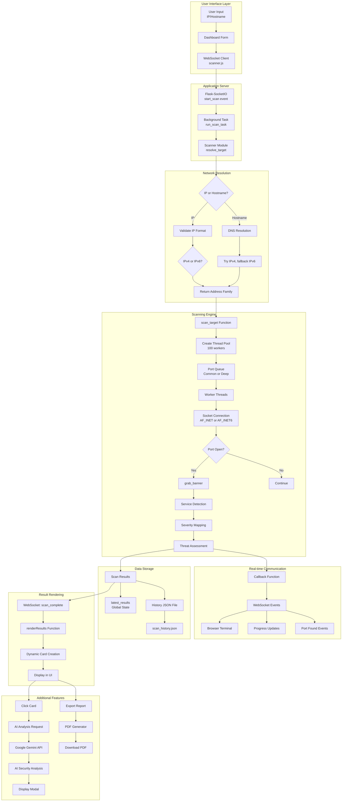
```mermaid
flowchart TD
    subgraph "User Interface Layer"
        A[User Input<br/>IP/Hostname] --> B[Dashboard Form]
        B --> C[WebSocket Client<br/>scanner.js]
    end
    
    subgraph "Application Server"
        C --> D[Flask-SocketIO<br/>start_scan event]
        D --> E[Background Task<br/>run_scan_task]
        E --> F[Scanner Module<br/>resolve_target]
    end
    
    subgraph "Network Resolution"
        F --> G{IP or Hostname?}
        G -->|IP| H[Validate IP Format]
        G -->|Hostname| I[DNS Resolution]
        H --> J{IPv4 or IPv6?}
        I --> K[Try IPv4, fallback IPv6]
        J --> L[Return Address Family]
        K --> L
    end
    
    subgraph "Scanning Engine"
        L --> M[scan_target Function]
        M --> N[Create Thread Pool<br/>100 workers]
        N --> O[Port Queue<br/>Common or Deep]
        O --> P[Worker Threads]
        P --> Q[Socket Connection<br/>AF_INET or AF_INET6]
        Q --> R{Port Open?}
        R -->|Yes| S[grab_banner]
        R -->|No| T[Continue]
        S --> U[Service Detection]
        U --> V[Severity Mapping]
        V --> W[Threat Assessment]
    end
    
    subgraph "Real-time Communication"
        W --> X[Callback Function]
        X --> Y[WebSocket Events]
        Y --> Z[Browser Terminal]
        Y --> AA[Progress Updates]
        Y --> AB[Port Found Events]
    end
    
    subgraph "Data Storage"
        W --> AC[Scan Results]
        AC --> AD[latest_results<br/>Global State]
        AC --> AE[History JSON File]
        AE --> AF[scan_history.json]
    end
    
    subgraph "Result Rendering"
        AC --> AG[WebSocket: scan_complete]
        AG --> AH[renderResults Function]
        AH --> AI[Dynamic Card Creation]
        AI --> AJ[Display in UI]
    end
    
    subgraph "Additional Features"
        AJ --> AK[Click Card]
        AK --> AL[AI Analysis Request]
        AL --> AM[Google Gemini API]
        AM --> AN[AI Security Analysis]
        AN --> AO[Display Modal]
        
        AJ --> AP[Export Report]
        AP --> AQ[PDF Generator]
        AQ --> AR[Download PDF]
    end
```

---

## 🧩 Component Interaction Diagram

### Module Dependencies and Interactions

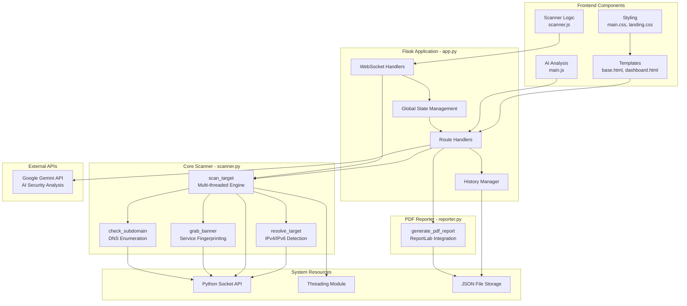
```mermaid
graph TB
    subgraph "Frontend Components"
        HTML[Templates<br/>base.html, dashboard.html]
        CSS[Styling<br/>main.css, landing.css]
        JS1[Scanner Logic<br/>scanner.js]
        JS2[AI Analysis<br/>main.js]
    end
    
    subgraph "Flask Application - app.py"
        Routes[Route Handlers]
        WS[WebSocket Handlers]
        State[Global State Management]
        HistoryMgr[History Manager]
    end
    
    subgraph "Core Scanner - scanner.py"
        Resolver[resolve_target<br/>IPv4/IPv6 Detection]
        Scanner[scan_target<br/>Multi-threaded Engine]
        Banner[grab_banner<br/>Service Fingerprinting]
        Subdomain[check_subdomain<br/>DNS Enumeration]
    end
    
    subgraph "PDF Reporter - reporter.py"
        PDFGen[generate_pdf_report<br/>ReportLab Integration]
    end
    
    subgraph "External APIs"
        Gemini[Google Gemini API<br/>AI Security Analysis]
    end
    
    subgraph "System Resources"
        SocketAPI[Python Socket API]
        Threading[Threading Module]
        FileSystem[JSON File Storage]
    end
    
    HTML --> Routes
    JS1 --> WS
    JS2 --> Routes
    CSS --> HTML
    
    Routes --> Scanner
    Routes --> HistoryMgr
    Routes --> PDFGen
    Routes --> Gemini
    
    WS --> Scanner
    WS --> State
    
    Scanner --> Resolver
    Scanner --> Banner
    Scanner --> Subdomain
    
    Resolver --> SocketAPI
    Scanner --> SocketAPI
    Scanner --> Threading
    Banner --> SocketAPI
    Subdomain --> SocketAPI
    
    HistoryMgr --> FileSystem
    PDFGen --> FileSystem
    
    State --> Routes
```

---

## 🔐 Security Scanning Process Detail

### Banner Grabbing & Service Detection

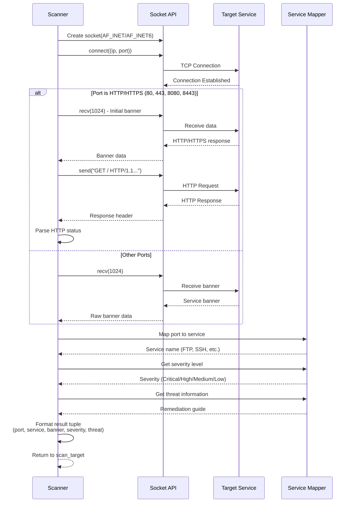
```mermaid
sequenceDiagram
    participant Scanner
    participant Socket as Socket API
    participant Service as Target Service
    participant Mapper as Service Mapper

    Scanner->>Socket: Create socket(AF_INET/AF_INET6)
    Scanner->>Socket: connect((ip, port))
    Socket->>Service: TCP Connection
    Service-->>Socket: Connection Established
    
    alt Port is HTTP/HTTPS (80, 443, 8080, 8443)
        Scanner->>Socket: recv(1024) - Initial banner
        Socket->>Service: Receive data
        Service-->>Socket: HTTP/HTTPS response
        Socket-->>Scanner: Banner data
        
        Scanner->>Socket: send("GET / HTTP/1.1...")
        Socket->>Service: HTTP Request
        Service-->>Socket: HTTP Response
        Socket-->>Scanner: Response header
        Scanner->>Scanner: Parse HTTP status
    else Other Ports
        Scanner->>Socket: recv(1024)
        Socket->>Service: Receive banner
        Service-->>Socket: Service banner
        Socket-->>Scanner: Raw banner data
    end
    
    Scanner->>Mapper: Map port to service
    Mapper-->>Scanner: Service name (FTP, SSH, etc.)
    
    Scanner->>Mapper: Get severity level
    Mapper-->>Scanner: Severity (Critical/High/Medium/Low)
    
    Scanner->>Mapper: Get threat information
    Mapper-->>Scanner: Remediation guide
    
    Scanner->>Scanner: Format result tuple<br/>(port, service, banner, severity, threat)
    Scanner-->>Scanner: Return to scan_target
```

---

## 📡 WebSocket Communication Flow

### Real-time Event System

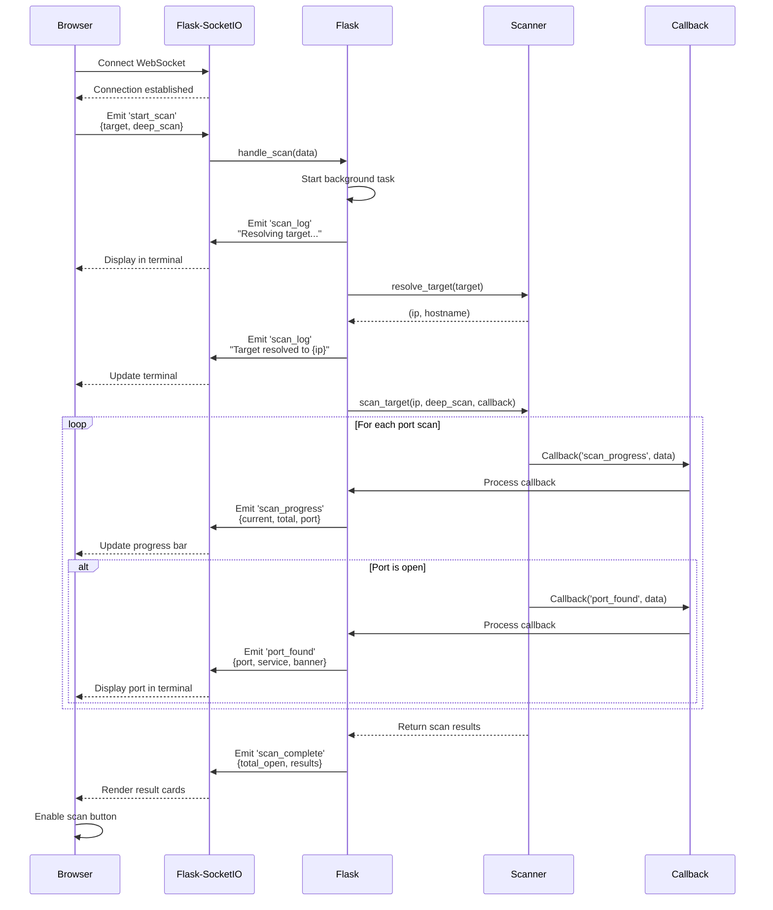
```mermaid
sequenceDiagram
    participant Browser
    participant SocketIO as Flask-SocketIO
    participant Flask
    participant Scanner
    participant Callback

    Browser->>SocketIO: Connect WebSocket
    SocketIO-->>Browser: Connection established
    
    Browser->>SocketIO: Emit 'start_scan'<br/>{target, deep_scan}
    SocketIO->>Flask: handle_scan(data)
    Flask->>Flask: Start background task
    
    Flask->>SocketIO: Emit 'scan_log'<br/>"Resolving target..."
    SocketIO-->>Browser: Display in terminal
    
    Flask->>Scanner: resolve_target(target)
    Scanner-->>Flask: (ip, hostname)
    
    Flask->>SocketIO: Emit 'scan_log'<br/>"Target resolved to {ip}"
    SocketIO-->>Browser: Update terminal
    
    Flask->>Scanner: scan_target(ip, deep_scan, callback)
    
    loop For each port scan
        Scanner->>Callback: Callback('scan_progress', data)
        Callback->>Flask: Process callback
        Flask->>SocketIO: Emit 'scan_progress'<br/>{current, total, port}
        SocketIO-->>Browser: Update progress bar
        
        alt Port is open
            Scanner->>Callback: Callback('port_found', data)
            Callback->>Flask: Process callback
            Flask->>SocketIO: Emit 'port_found'<br/>{port, service, banner}
            SocketIO-->>Browser: Display port in terminal
        end
    end
    
    Scanner-->>Flask: Return scan results
    Flask->>SocketIO: Emit 'scan_complete'<br/>{total_open, results}
    SocketIO-->>Browser: Render result cards
    Browser->>Browser: Enable scan button
```

---

## 🤖 AI Analysis Integration Flow

### Google Gemini API Integration

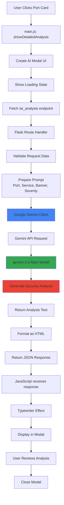
```mermaid
flowchart TD
    Start[User Clicks Port Card] --> JS[main.js: showDetailedAnalysis]
    JS --> Modal[Create AI Modal UI]
    Modal --> Loading[Show Loading State]
    Loading --> Fetch[Fetch /ai_analysis endpoint]
    
    Fetch --> Flask[Flask Route Handler]
    Flask --> Validate[Validate Request Data]
    Validate --> Prepare[Prepare Prompt<br/>Port, Service, Banner, Severity]
    
    Prepare --> Gemini[Google Gemini Client]
    Gemini --> API[Gemini API Request]
    API --> Model[gemini-2.5-flash Model]
    
    Model --> Analysis[Generate Security Analysis]
    Analysis --> Response[Return Analysis Text]
    
    Response --> Format[Format as HTML]
    Format --> Return[Return JSON Response]
    
    Return --> JS2[JavaScript receives response]
    JS2 --> TypeWriter[Typewriter Effect]
    TypeWriter --> Display[Display in Modal]
    
    Display --> User[User Reviews Analysis]
    User --> Close[Close Modal]
    
    style Gemini fill:#4285f4
    style Model fill:#34a853
    style Analysis fill:#ea4335
```

---

## 📁 Complete Project Structure

### File Organization & Dependencies

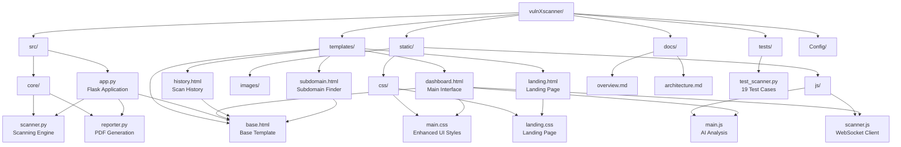
```mermaid
graph TD
    Root[vulnXscanner/] --> Src[src/]
    Root --> Static[static/]
    Root --> Templates[templates/]
    Root --> Docs[docs/]
    Root --> Tests[tests/]
    Root --> Config[Config/]
    
    Src --> App[app.py<br/>Flask Application]
    Src --> Core[core/]
    
    Core --> Scanner[scanner.py<br/>Scanning Engine]
    Core --> Reporter[reporter.py<br/>PDF Generation]
    
    Static --> CSS[css/]
    Static --> JS[js/]
    Static --> Images[images/]
    
    CSS --> MainCSS[main.css<br/>Enhanced UI Styles]
    CSS --> LandingCSS[landing.css<br/>Landing Page]
    
    JS --> MainJS[main.js<br/>AI Analysis]
    JS --> ScannerJS[scanner.js<br/>WebSocket Client]
    
    Templates --> Base[base.html<br/>Base Template]
    Templates --> Dashboard[dashboard.html<br/>Main Interface]
    Templates --> History[history.html<br/>Scan History]
    Templates --> Subdomain[subdomain.html<br/>Subdomain Finder]
    Templates --> Landing[landing.html<br/>Landing Page]
    
    Docs --> Overview[overview.md]
    Docs --> Arch[architecture.md]
    
    Tests --> TestScanner[test_scanner.py<br/>19 Test Cases]
    
    App --> Scanner
    App --> Reporter
    App --> Base
    Dashboard --> Base
    History --> Base
    Subdomain --> Base
    Landing --> LandingCSS
    
    Dashboard --> ScannerJS
    Dashboard --> MainJS
    Dashboard --> MainCSS
```

---

## 🔄 Request-Response Cycle

### Complete HTTP/WebSocket Request Flow

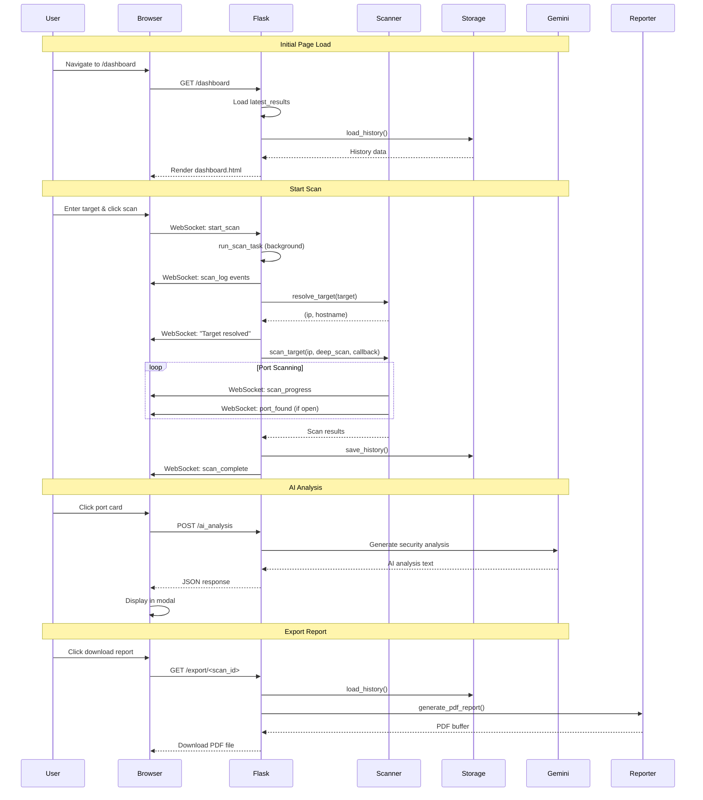
```mermaid
sequenceDiagram
    participant User
    participant Browser
    participant Flask
    participant Scanner
    participant Storage
    participant Gemini

    Note over User,Gemini: Initial Page Load
    User->>Browser: Navigate to /dashboard
    Browser->>Flask: GET /dashboard
    Flask->>Flask: Load latest_results
    Flask->>Storage: load_history()
    Storage-->>Flask: History data
    Flask-->>Browser: Render dashboard.html
    
    Note over User,Gemini: Start Scan
    User->>Browser: Enter target & click scan
    Browser->>Flask: WebSocket: start_scan
    Flask->>Flask: run_scan_task (background)
    Flask->>Browser: WebSocket: scan_log events
    
    Flask->>Scanner: resolve_target(target)
    Scanner-->>Flask: (ip, hostname)
    Flask->>Browser: WebSocket: "Target resolved"
    
    Flask->>Scanner: scan_target(ip, deep_scan, callback)
    loop Port Scanning
        Scanner->>Browser: WebSocket: scan_progress
        Scanner->>Browser: WebSocket: port_found (if open)
    end
    Scanner-->>Flask: Scan results
    Flask->>Storage: save_history()
    Flask->>Browser: WebSocket: scan_complete
    
    Note over User,Gemini: AI Analysis
    User->>Browser: Click port card
    Browser->>Flask: POST /ai_analysis
    Flask->>Gemini: Generate security analysis
    Gemini-->>Flask: AI analysis text
    Flask-->>Browser: JSON response
    Browser->>Browser: Display in modal
    
    Note over User,Gemini: Export Report
    User->>Browser: Click download report
    Browser->>Flask: GET /export/<scan_id>
    Flask->>Storage: load_history()
    Flask->>Reporter: generate_pdf_report()
    Reporter-->>Flask: PDF buffer
    Flask-->>Browser: Download PDF file
```

---

## 🧪 Testing Architecture

### Test Suite Coverage

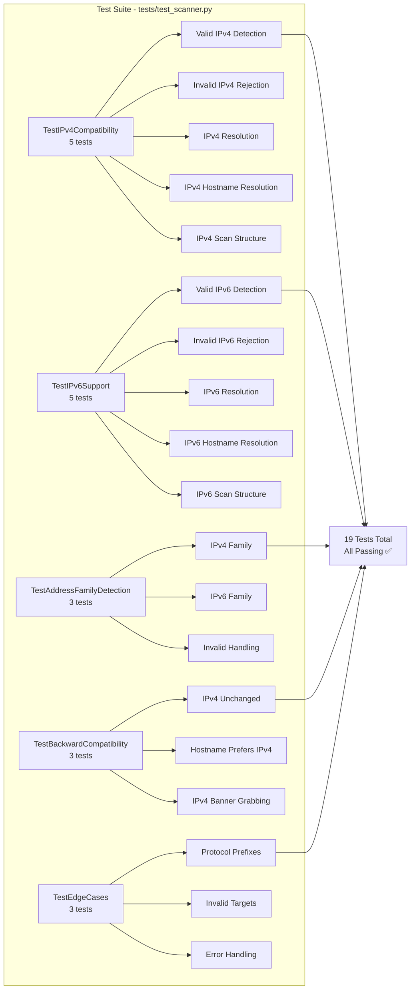
```mermaid
graph LR
    subgraph "Test Suite - tests/test_scanner.py"
        A[TestIPv4Compatibility<br/>5 tests] --> B[Valid IPv4 Detection]
        A --> C[Invalid IPv4 Rejection]
        A --> D[IPv4 Resolution]
        A --> E[IPv4 Hostname Resolution]
        A --> F[IPv4 Scan Structure]
        
        G[TestIPv6Support<br/>5 tests] --> H[Valid IPv6 Detection]
        G --> I[Invalid IPv6 Rejection]
        G --> J[IPv6 Resolution]
        G --> K[IPv6 Hostname Resolution]
        G --> L[IPv6 Scan Structure]
        
        M[TestAddressFamilyDetection<br/>3 tests] --> N[IPv4 Family]
        M --> O[IPv6 Family]
        M --> P[Invalid Handling]
        
        Q[TestBackwardCompatibility<br/>3 tests] --> R[IPv4 Unchanged]
        Q --> S[Hostname Prefers IPv4]
        Q --> T[IPv4 Banner Grabbing]
        
        U[TestEdgeCases<br/>3 tests] --> V[Protocol Prefixes]
        U --> W[Invalid Targets]
        U --> X[Error Handling]
    end
    
    B --> Results[19 Tests Total<br/>All Passing ✅]
    H --> Results
    N --> Results
    R --> Results
    V --> Results
```

---

## ⚙️ Features

### ⚡ High-speed Port Scan Engine
- Multi-threaded scanning (100 concurrent threads)
- Deep scan up to 1024 ports
- Common scan mode (23 top ports)
- **IPv4 and IPv6 support**

### 🔍 Fingerprinting Engine
- Banner capture from services
- Web protocol detection (HTTP/HTTPS)
- Threat intelligence mapping
- Service identification

### 🤖 AI Model Analysis
- Google Gemini 2.5 Flash integration
- Attack vectors identification
- Security recommendations
- Exploit scenarios
- Severity scoring

### 🌐 Subdomain Finder
- DNS-based resolver
- Smart default subdomain list
- Parallel enumeration

### 📄 PDF Report Generation
- Professional scan reports
- Detailed port information
- Threat assessments
- Exportable format

### 🎨 UI / UX
- Dark theme design
- Modern card layout
- Terminal logs display
- Fully responsive layout
- Real-time WebSocket updates

---

## 📂 Tech Stack

| Technology | Purpose |
|------------|---------|
| Python 3.9+ | Backend language |
| Flask 2.2.5 | Web framework |
| Flask-SocketIO 5.3.4 | WebSocket support |
| Socket API | Network communication (IPv4/IPv6) |
| Multithreading | Concurrent scanning (100 threads) |
| HTML/CSS/JavaScript | Frontend |
| Jinja2 | Template engine |
| ReportLab | PDF generation |
| Google Gemini API | AI security analysis |
| python-dotenv | Environment variable management |

---

## 📥 Installation

### 1️⃣ Clone the Repository
```bash
git clone https://github.com/shubhushubhu99/vulnxscanner.git
cd vulnxscanner
```

### 2️⃣ Install Dependencies
```bash
pip install -r requirements.txt
```

### 3️⃣ Configure Environment Variables

Create a `.env` file in the root directory:

```bash
# Required for AI Analysis
GEMINI_API_KEY=your_gemini_api_key_here

# Optional - Flask Secret Key (auto-generated if not provided)
FLASK_SECRET_KEY=your_secret_key_here
```

**Get Gemini API Key:** [https://aistudio.google.com/app/apikey](https://aistudio.google.com/app/apikey)

### 4️⃣ Run the Application
```bash
python src/app.py
```

### 5️⃣ Open in Browser
Navigate to:
```
http://127.0.0.1:5000
```

---

## 📚 Documentation

- 📖 [Project Overview](docs/overview.md)
- 🏗️ [Project Architecture](docs/architecture.md)
- ✅ [Test Results](TEST_RESULTS.md)

---

## 📁 Project Structure

```text
vulnXscanner/
│
├── src/
│   ├── app.py                 # Main Flask application
│   └── core/
│       ├── scanner.py         # Scanning engine (IPv4/IPv6)
│       └── reporter.py        # PDF report generation
│
├── static/
│   ├── css/
│   │   ├── main.css          # Enhanced UI styles
│   │   └── landing.css       # Landing page styles
│   ├── js/
│   │   ├── main.js           # AI analysis integration
│   │   └── scanner.js        # WebSocket client & scanning
│   └── images/
│       └── hero.png          # Hero image
│
├── templates/
│   ├── base.html             # Base template
│   ├── dashboard.html        # Main scanning interface
│   ├── history.html          # Scan history page
│   ├── landing.html          # Landing page
│   └── subdomain.html        # Subdomain finder
│
├── tests/
│   ├── __init__.py
│   └── test_scanner.py       # Comprehensive test suite (19 tests)
│
├── docs/
│   ├── overview.md           # Project overview
│   └── architecture.md       # Architecture documentation
│
├── Config/
│   ├── Procfile             # Deployment configuration
│   └── .runtime.txt         # Runtime specification
│
├── Dockerfile               # Docker configuration
├── requirements.txt         # Python dependencies
├── scan_history.json       # Scan history storage (generated)
├── TEST_RESULTS.md         # Test documentation
├── CODE_OF_CONDUCT.md
├── CONTRIBUTING.md
└── README.md
```

---

## 🔬 How It Works - Technical Deep Dive

### 1. Target Resolution Process

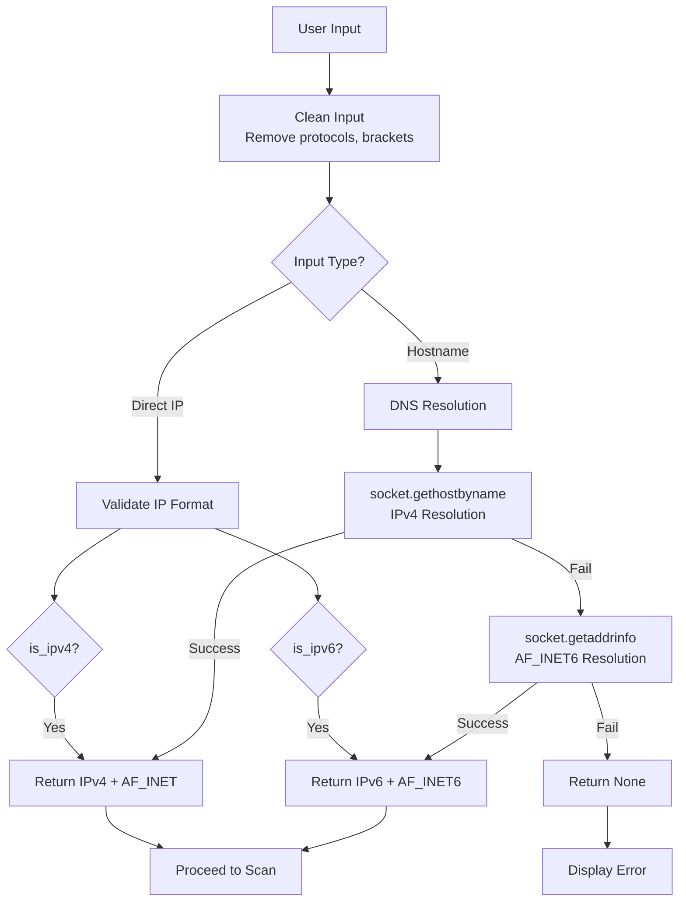
```mermaid
flowchart TD
    Input[User Input] --> Clean[Clean Input<br/>Remove protocols, brackets]
    Clean --> Type{Input Type?}
    
    Type -->|Direct IP| Validate[Validate IP Format]
    Type -->|Hostname| DNS[DNS Resolution]
    
    Validate --> IPv4Check{is_ipv4?}
    Validate --> IPv6Check{is_ipv6?}
    
    IPv4Check -->|Yes| ReturnIPv4[Return IPv4 + AF_INET]
    IPv6Check -->|Yes| ReturnIPv6[Return IPv6 + AF_INET6]
    
    DNS --> TryIPv4[socket.gethostbyname<br/>IPv4 Resolution]
    TryIPv4 -->|Success| ReturnIPv4
    TryIPv4 -->|Fail| TryIPv6[socket.getaddrinfo<br/>AF_INET6 Resolution]
    TryIPv6 -->|Success| ReturnIPv6
    TryIPv6 -->|Fail| Error[Return None]
    
    ReturnIPv4 --> Scan[Proceed to Scan]
    ReturnIPv6 --> Scan
    Error --> Fail[Display Error]
```

### 2. Multi-threaded Port Scanning

The scanning engine uses a producer-consumer pattern with thread-safe queues:

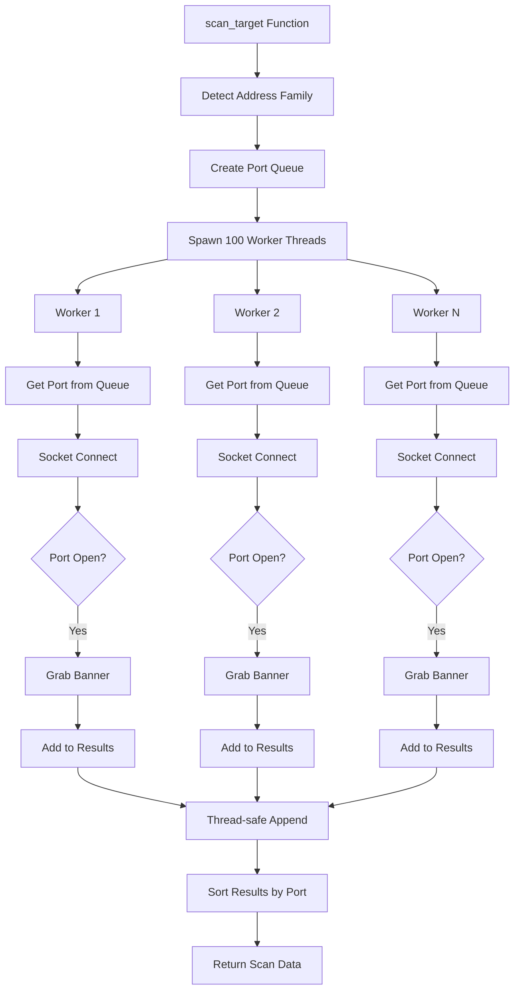
```mermaid
graph TB
    Start[scan_target Function] --> Detect[Detect Address Family]
    Detect --> Queue[Create Port Queue]
    Queue --> ThreadPool[Spawn 100 Worker Threads]
    
    ThreadPool --> Worker1[Worker 1]
    ThreadPool --> Worker2[Worker 2]
    ThreadPool --> WorkerN[Worker N]
    
    Worker1 --> GetPort1[Get Port from Queue]
    Worker2 --> GetPort2[Get Port from Queue]
    WorkerN --> GetPortN[Get Port from Queue]
    
    GetPort1 --> Connect1[Socket Connect]
    GetPort2 --> Connect2[Socket Connect]
    GetPortN --> ConnectN[Socket Connect]
    
    Connect1 --> Check1{Port Open?}
    Connect2 --> Check2{Port Open?}
    ConnectN --> CheckN{Port Open?}
    
    Check1 -->|Yes| Banner1[Grab Banner]
    Check2 -->|Yes| Banner2[Grab Banner]
    CheckN -->|Yes| BannerN[Grab Banner]
    
    Banner1 --> Result1[Add to Results]
    Banner2 --> Result2[Add to Results]
    BannerN --> ResultN[Add to Results]
    
    Result1 --> Lock[Thread-safe Append]
    Result2 --> Lock
    ResultN --> Lock
    
    Lock --> Sort[Sort Results by Port]
    Sort --> Return[Return Scan Data]
```

### 3. Banner Grabbing Mechanism

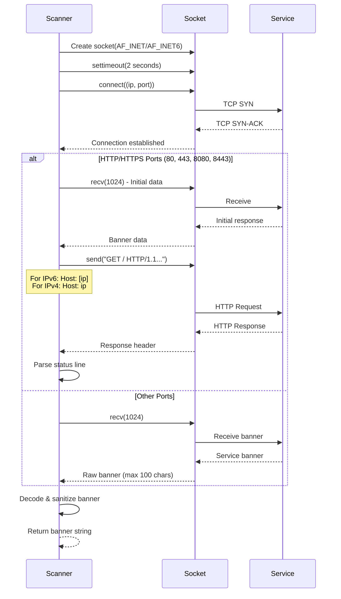
```mermaid
sequenceDiagram
    participant Scanner
    participant Socket
    participant Service

    Scanner->>Socket: Create socket(AF_INET/AF_INET6)
    Scanner->>Socket: settimeout(2 seconds)
    Scanner->>Socket: connect((ip, port))
    Socket->>Service: TCP SYN
    Service-->>Socket: TCP SYN-ACK
    Socket-->>Scanner: Connection established
    
    alt HTTP/HTTPS Ports (80, 443, 8080, 8443)
        Scanner->>Socket: recv(1024) - Initial data
        Socket->>Service: Receive
        Service-->>Socket: Initial response
        Socket-->>Scanner: Banner data
        
        Scanner->>Socket: send("GET / HTTP/1.1...")
        Note over Scanner: For IPv6: Host: [ip]<br/>For IPv4: Host: ip
        Socket->>Service: HTTP Request
        Service-->>Socket: HTTP Response
        Socket-->>Scanner: Response header
        Scanner->>Scanner: Parse status line
    else Other Ports
        Scanner->>Socket: recv(1024)
        Socket->>Service: Receive banner
        Service-->>Socket: Service banner
        Socket-->>Scanner: Raw banner (max 100 chars)
    end
    
    Scanner->>Scanner: Decode & sanitize banner
    Scanner-->>Scanner: Return banner string
```

---

## 🧪 Testing & Quality Assurance

### Test Coverage

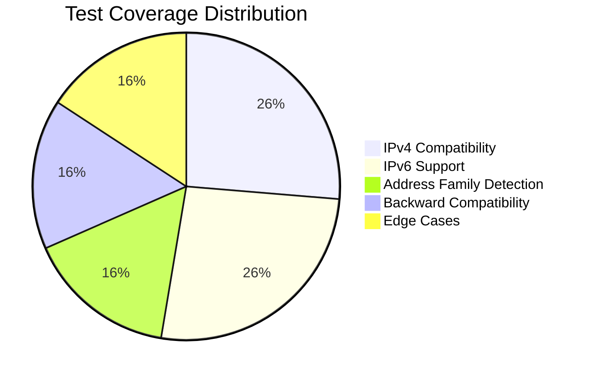
```mermaid
pie title Test Coverage Distribution
    "IPv4 Compatibility" : 5
    "IPv6 Support" : 5
    "Address Family Detection" : 3
    "Backward Compatibility" : 3
    "Edge Cases" : 3
```

**Total: 19 comprehensive tests** - All passing ✅

Run tests:
```bash
python tests/test_scanner.py
```

---

## 🚀 Deployment Architecture

### Production Deployment Flow

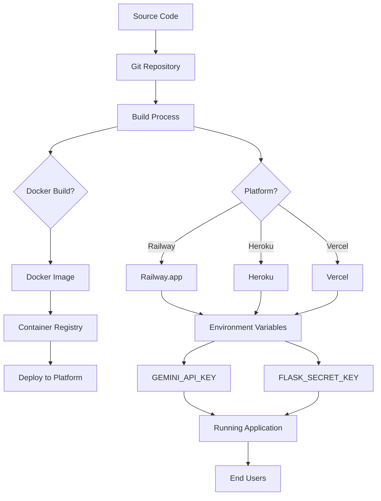
```mermaid
graph TB
    Code[Source Code] --> Git[Git Repository]
    Git --> Build[Build Process]
    
    Build --> Docker{Docker Build?}
    Build --> Platform{Platform?}
    
    Docker --> Image[Docker Image]
    Image --> Registry[Container Registry]
    Registry --> Deploy1[Deploy to Platform]
    
    Platform -->|Railway| Railway[Railway.app]
    Platform -->|Heroku| Heroku[Heroku]
    Platform -->|Vercel| Vercel[Vercel]
    
    Railway --> Env[Environment Variables]
    Heroku --> Env
    Vercel --> Env
    
    Env --> GEMINI[GEMINI_API_KEY]
    Env --> FLASK[FLASK_SECRET_KEY]
    
    GEMINI --> App[Running Application]
    FLASK --> App
    
    App --> Users[End Users]
```

---

## 🔒 Security Considerations

### Input Validation & Security Flow

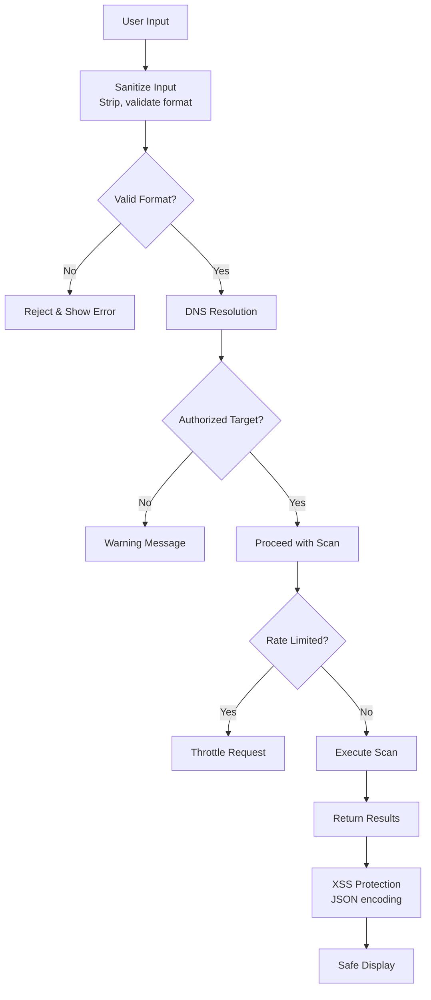
```mermaid
flowchart TD
    UserInput[User Input] --> Sanitize[Sanitize Input<br/>Strip, validate format]
    Sanitize --> Validate{Valid Format?}
    
    Validate -->|No| Reject[Reject & Show Error]
    Validate -->|Yes| Resolve[DNS Resolution]
    
    Resolve --> CheckAuth{Authorized Target?}
    CheckAuth -->|No| Warn[Warning Message]
    CheckAuth -->|Yes| Proceed[Proceed with Scan]
    
    Proceed --> RateLimit{Rate Limited?}
    RateLimit -->|Yes| Throttle[Throttle Request]
    RateLimit -->|No| Scan[Execute Scan]
    
    Scan --> Results[Return Results]
    Results --> XSS[XSS Protection<br/>JSON encoding]
    XSS --> Display[Safe Display]
```

---

## 📊 Performance Characteristics

### Scanning Performance Metrics

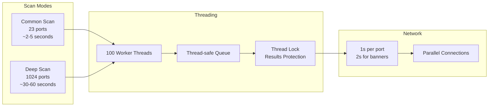
```mermaid
graph LR
    subgraph "Scan Modes"
        Common[Common Scan<br/>23 ports<br/>~2-5 seconds]
        Deep[Deep Scan<br/>1024 ports<br/>~30-60 seconds]
    end
    
    subgraph "Threading"
        Threads[100 Worker Threads]
        Queue[Thread-safe Queue]
        Lock[Thread Lock<br/>Results Protection]
    end
    
    subgraph "Network"
        Timeout[1s per port<br/>2s for banners]
        Concurrent[Parallel Connections]
    end
    
    Common --> Threads
    Deep --> Threads
    Threads --> Queue
    Queue --> Lock
    Lock --> Timeout
    Timeout --> Concurrent
```

---

## 🎯 Use Cases & Workflows

### Typical User Workflow

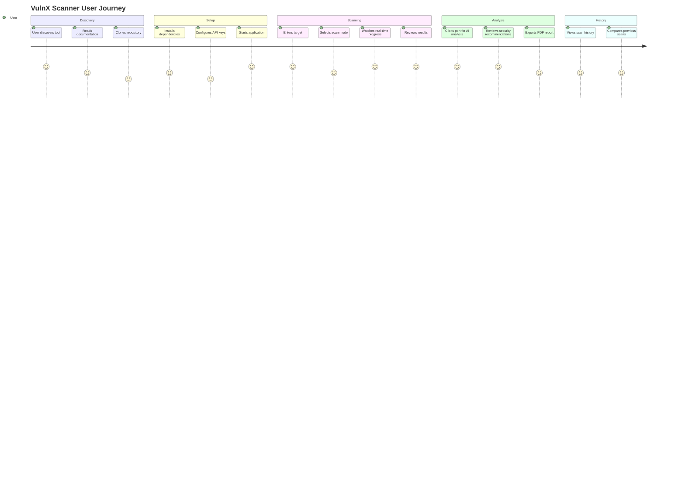
```mermaid
journey
    title VulnX Scanner User Journey
    section Discovery
      User discovers tool: 5: User
      Reads documentation: 4: User
      Clones repository: 3: User
    section Setup
      Installs dependencies: 4: User
      Configures API keys: 3: User
      Starts application: 5: User
    section Scanning
      Enters target: 5: User
      Selects scan mode: 4: User
      Watches real-time progress: 5: User
      Reviews results: 5: User
    section Analysis
      Clicks port for AI analysis: 5: User
      Reviews security recommendations: 5: User
      Exports PDF report: 4: User
    section History
      Views scan history: 4: User
      Compares previous scans: 4: User
```

---

## 🔧 Configuration & Environment

### Environment Variables

```mermaid
graph TD
    Env[.env File] --> GEMINI[GEMINI_API_KEY<br/>Required for AI Analysis]
    Env --> FLASK[FLASK_SECRET_KEY<br/>Optional - Auto-generated]
    Env --> SCAN[SCAN_THREADS<br/>Optional - Default: 100]
    
    GEMINI --> App[Flask Application]
    FLASK --> App
    SCAN --> Scanner[Scanner Engine]
    
    App --> Init[Application Initialization]
    Scanner --> Config[Thread Configuration]
```

---

## 📈 Feature Roadmap

### Current & Planned Features

```mermaid
gantt
    title VulnX Scanner Development Roadmap
    dateFormat  YYYY-MM-DD
    section Core Features
    Port Scanning (IPv4)        :done, 2024-01-01, 2024-03-01
    IPv6 Support                :done, 2024-03-01, 2024-06-01
    WebSocket Real-time          :done, 2024-03-01, 2024-04-01
    section Advanced Features
    AI Analysis (Gemini)         :done, 2024-06-01, 2024-08-01
    PDF Reports                  :done, 2024-08-01, 2024-09-01
    Scan History                 :done, 2024-09-01, 2024-10-01
    section UI/UX
    Enhanced UI Design           :done, 2024-10-01, 2024-12-01
    Responsive Layout            :done, 2024-11-01, 2024-12-01
    section Testing
    Comprehensive Test Suite     :done, 2024-12-01, 2025-01-01
```

---

## 🤝 Contributing

We welcome contributions from the community! Please read our [Contributing Guidelines](CONTRIBUTING.md) and [Code of Conduct](CODE_OF_CONDUCT.md) before submitting pull requests.

For detailed contribution instructions, see [CONTRIBUTING.md](CONTRIBUTING.md)

---

## ⚠️ Ethical Use Policy

**VulnX Scanner** is designed for **authorized security testing only**. Users must:

- ✅ Obtain proper authorization before scanning any network
- ✅ Comply with all applicable laws and regulations
- ✅ Use the tool for legitimate security research and testing
- ❌ Never use for unauthorized access or malicious purposes

**Disclaimer:** The authors are not responsible for misuse of this tool.

---

## 📜 License

This project is licensed under the **MIT License** - see the [LICENSE](LICENSE) file for details.

---

## 📬 Contact & Support

- 🐛 [Report Issues](https://github.com/shubhushubhu99/vulnXscanner/issues)
- 💡 [Request Features](https://github.com/shubhushubhu99/vulnXscanner/issues/new)
- 📧 Contact: [Open an Issue](https://github.com/shubhushubhu99/vulnXscanner/issues)

---

<div align="center">

### 👤 Project Author
**Team SilentXploit**

### 💻 Lead Developer & Maintainer
**Shubham Yadav**

### 👥 Core Development Team
**Md Farhan** • **Uday Shankar Singh**

---

### ⭐ If you like this project, please give it a star on GitHub! ⭐

**Made with ❤️ by Team SilentXploit**

[Live Demo](https://vulnx-scanner-production.up.railway.app/) • [Documentation](docs/overview.md) • [Report Bug](https://github.com/shubhushubhu99/vulnXscanner/issues)

</div>
