<div align="center">

# 🌐 VulnX Security Scanner

### **Real-time Port Analysis • Service Fingerprinting • Live Threat Intelligence**

A high-performance Python + Flask based security scanner that performs real-time port scanning, banner grabbing, severity scoring, threat mapping, and subdomain enumeration — all via a modern dark dashboard UI.

[](https://www.python.org/)
[](https://flask.palletsprojects.com/)
[](https://github.com/shubhushubhu99/vulnXscanner)
[](https://vulnx-scanner-production.up.railway.app/)
[](LICENSE)

### 🌎 [Live Demo](https://vulnx-scanner-production.up.railway.app/)

</div>

---

## 🚀 About VulnX

VulnX Scanner is a professional-grade **cybersecurity auditing tool** built using **Python + Flask**. It performs:

- ✔ Port scanning (IPv4 & IPv6)
- ✔ Banner grabbing
- ✔ Service detection
- ✔ Severity scoring
- ✔ Threat assessment
- ✔ AI-based analysis (Google Gemini)
- ✔ Subdomain enumeration
- ✔ PDF report generation
- ✔ Fully responsive UI

**Designed for:** Security analysts, penetration testers, red teams, researchers, and students.

---

## 🏗️ System Architecture

### High-Level Architecture Diagram


---

## 🔄 Complete Scanning Workflow

### Detailed Port Scanning Process


---

## 🌐 IPv4/IPv6 Detection & Resolution Flow

### Address Family Detection Process


---

## 🔍 Port Scanning Engine Architecture

### Multi-threaded Scanning Process


---

## 📊 Data Flow Architecture

### Complete System Data Flow


---

## 🧩 Component Interaction Diagram

### Module Dependencies and Interactions


---

## 🔐 Security Scanning Process Detail

### Banner Grabbing & Service Detection


---

## 📡 WebSocket Communication Flow

### Real-time Event System


---

## 🤖 AI Analysis Integration Flow

### Google Gemini API Integration


---

## 📁 Complete Project Structure

### File Organization & Dependencies


---

## 🔄 Request-Response Cycle

### Complete HTTP/WebSocket Request Flow


---

## 🧪 Testing Architecture

### Test Suite Coverage

```mermaid
graph LR
    subgraph "Test Suite - tests/test_scanner.py"
        A[TestIPv4Compatibility<br/>5 tests] --> B[Valid IPv4 Detection]
        A --> C[Invalid IPv4 Rejection]
        A --> D[IPv4 Resolution]
        A --> E[IPv4 Hostname Resolution]
        A --> F[IPv4 Scan Structure]
        
        G[TestIPv6Support<br/>5 tests] --> H[Valid IPv6 Detection]
        G --> I[Invalid IPv6 Rejection]
        G --> J[IPv6 Resolution]
        G --> K[IPv6 Hostname Resolution]
        G --> L[IPv6 Scan Structure]
        
        M[TestAddressFamilyDetection<br/>3 tests] --> N[IPv4 Family]
        M --> O[IPv6 Family]
        M --> P[Invalid Handling]
        
        Q[TestBackwardCompatibility<br/>3 tests] --> R[IPv4 Unchanged]
        Q --> S[Hostname Prefers IPv4]
        Q --> T[IPv4 Banner Grabbing]
        
        U[TestEdgeCases<br/>3 tests] --> V[Protocol Prefixes]
        U --> W[Invalid Targets]
        U --> X[Error Handling]
    end
    
    B --> Results[19 Tests Total<br/>All Passing ✅]
    H --> Results
    N --> Results
    R --> Results
    V --> Results
```



---

## ⚙️ Features

### ⚡ High-speed Port Scan Engine
- Multi-threaded scanning (100 concurrent threads)
- Deep scan up to 1024 ports
- Common scan mode (23 top ports)
- **IPv4 and IPv6 support**

### 🔍 Fingerprinting Engine
- Banner capture from services
- Web protocol detection (HTTP/HTTPS)
- Threat intelligence mapping
- Service identification

### 🤖 AI Model Analysis
- Google Gemini 2.5 Flash integration
- Attack vectors identification
- Security recommendations
- Exploit scenarios
- Severity scoring

### 🌐 Subdomain Finder
- DNS-based resolver
- Smart default subdomain list
- Parallel enumeration

### 📄 PDF Report Generation
- Professional scan reports
- Detailed port information
- Threat assessments
- Exportable format

### 🎨 UI / UX
- Dark theme design
- Modern card layout
- Terminal logs display
- Fully responsive layout
- Real-time WebSocket updates

---

## 📂 Tech Stack

| Technology | Purpose |
|------------|---------|
| Python 3.9+ | Backend language |
| Flask 2.2.5 | Web framework |
| Flask-SocketIO 5.3.4 | WebSocket support |
| Socket API | Network communication (IPv4/IPv6) |
| Multithreading | Concurrent scanning (100 threads) |
| HTML/CSS/JavaScript | Frontend |
| Jinja2 | Template engine |
| ReportLab | PDF generation |
| Google Gemini API | AI security analysis |
| python-dotenv | Environment variable management |

---

## 📥 Installation

### 1️⃣ Clone the Repository
```bash
git clone https://github.com/shubhushubhu99/vulnxscanner.git
cd vulnxscanner
```

### 2️⃣ Install Dependencies
```bash
pip install -r requirements.txt
```

### 3️⃣ Configure Environment Variables

Create a `.env` file in the root directory:

```bash
# Required for AI Analysis
GEMINI_API_KEY=your_gemini_api_key_here

# Optional - Flask Secret Key (auto-generated if not provided)
FLASK_SECRET_KEY=your_secret_key_here
```

**Get Gemini API Key:** [https://aistudio.google.com/app/apikey](https://aistudio.google.com/app/apikey)

### 4️⃣ Run the Application
```bash
python src/app.py
```

### 5️⃣ Open in Browser
Navigate to:
```
http://127.0.0.1:5000
```

---

## 📚 Documentation

- 📖 [Project Overview](docs/overview.md)
- 🏗️ [Project Architecture](docs/architecture.md)
- ✅ [Test Results](TEST_RESULTS.md)

---

## 📁 Project Structure

```text
vulnXscanner/
│
├── src/
│   ├── app.py                 # Main Flask application
│   └── core/
│       ├── scanner.py         # Scanning engine (IPv4/IPv6)
│       └── reporter.py        # PDF report generation
│
├── static/
│   ├── css/
│   │   ├── main.css          # Enhanced UI styles
│   │   └── landing.css       # Landing page styles
│   ├── js/
│   │   ├── main.js           # AI analysis integration
│   │   └── scanner.js        # WebSocket client & scanning
│   └── images/
│       └── hero.png          # Hero image
│
├── templates/
│   ├── base.html             # Base template
│   ├── dashboard.html        # Main scanning interface
│   ├── history.html          # Scan history page
│   ├── landing.html          # Landing page
│   └── subdomain.html        # Subdomain finder
│
├── tests/
│   ├── __init__.py
│   └── test_scanner.py       # Comprehensive test suite (19 tests)
│
├── docs/
│   ├── overview.md           # Project overview
│   └── architecture.md       # Architecture documentation
│
├── Config/
│   ├── Procfile             # Deployment configuration
│   └── .runtime.txt         # Runtime specification
│
├── Dockerfile               # Docker configuration
├── requirements.txt         # Python dependencies
├── scan_history.json       # Scan history storage (generated)
├── TEST_RESULTS.md         # Test documentation
├── CODE_OF_CONDUCT.md
├── CONTRIBUTING.md
└── README.md
```

---

## 🔬 How It Works - Technical Deep Dive

### 1. Target Resolution Process


### 2. Multi-threaded Port Scanning

The scanning engine uses a producer-consumer pattern with thread-safe queues:


### 3. Banner Grabbing Mechanism


---

## 🧪 Testing & Quality Assurance

### Test Coverage


**Total: 19 comprehensive tests** - All passing ✅

Run tests:
```bash
python tests/test_scanner.py
```

---

## 🚀 Deployment Architecture

### Production Deployment Flow


---

## 🔒 Security Considerations

### Input Validation & Security Flow


---

## 📊 Performance Characteristics

### Scanning Performance Metrics


---

## 🎯 Use Cases & Workflows

### Typical User Workflow


---

## 🔧 Configuration & Environment

### Environment Variables

```mermaid
graph TD
    Env[.env File] --> GEMINI[GEMINI_API_KEY<br/>Required for AI Analysis]
    Env --> FLASK[FLASK_SECRET_KEY<br/>Optional - Auto-generated]
    Env --> SCAN[SCAN_THREADS<br/>Optional - Default: 100]
    
    GEMINI --> App[Flask Application]
    FLASK --> App
    SCAN --> Scanner[Scanner Engine]
    
    App --> Init[Application Initialization]
    Scanner --> Config[Thread Configuration]
```

---

## 📈 Feature Roadmap

### Current & Planned Features

```mermaid
gantt
    title VulnX Scanner Development Roadmap
    dateFormat  YYYY-MM-DD
    section Core Features
    Port Scanning (IPv4)        :done, 2024-01-01, 2024-03-01
    IPv6 Support                :done, 2024-03-01, 2024-06-01
    WebSocket Real-time          :done, 2024-03-01, 2024-04-01
    section Advanced Features
    AI Analysis (Gemini)         :done, 2024-06-01, 2024-08-01
    PDF Reports                  :done, 2024-08-01, 2024-09-01
    Scan History                 :done, 2024-09-01, 2024-10-01
    section UI/UX
    Enhanced UI Design           :done, 2024-10-01, 2024-12-01
    Responsive Layout            :done, 2024-11-01, 2024-12-01
    section Testing
    Comprehensive Test Suite     :done, 2024-12-01, 2025-01-01
```

---

## 🤝 Contributing

We welcome contributions from the community! Please read our [Contributing Guidelines](CONTRIBUTING.md) and [Code of Conduct](CODE_OF_CONDUCT.md) before submitting pull requests.

For detailed contribution instructions, see [CONTRIBUTING.md](CONTRIBUTING.md)

---

## ⚠️ Ethical Use Policy

**VulnX Scanner** is designed for **authorized security testing only**. Users must:

- ✅ Obtain proper authorization before scanning any network
- ✅ Comply with all applicable laws and regulations
- ✅ Use the tool for legitimate security research and testing
- ❌ Never use for unauthorized access or malicious purposes

**Disclaimer:** The authors are not responsible for misuse of this tool.

---

## 📜 License

This project is licensed under the **MIT License** - see the [LICENSE](LICENSE) file for details.

---

## 📬 Contact & Support

- 🐛 [Report Issues](https://github.com/shubhushubhu99/vulnXscanner/issues)
- 💡 [Request Features](https://github.com/shubhushubhu99/vulnXscanner/issues/new)
- 📧 Contact: [Open an Issue](https://github.com/shubhushubhu99/vulnXscanner/issues)

---

<div align="center">

### 👤 Project Author
**Team SilentXploit**

### 💻 Lead Developer & Maintainer
**Shubham Yadav**

### 👥 Core Development Team
**Md Farhan** • **Uday Shankar Singh**

---

### ⭐ If you like this project, please give it a star on GitHub! ⭐

**Made with ❤️ by Team SilentXploit**

[Live Demo](https://vulnx-scanner-production.up.railway.app/) • [Documentation](docs/overview.md) • [Report Bug](https://github.com/shubhushubhu99/vulnXscanner/issues)

</div>
