<div align="center">

# 🌐 VulnX Security Scanner

### **Real-time Port Analysis • Service Fingerprinting • Live Threat Intelligence**

A high-performance Python + Flask based security scanner that performs real-time port scanning, banner grabbing, severity scoring, threat mapping, and subdomain enumeration — all via a modern dark dashboard UI.

[](https://www.python.org/)
[](https://flask.palletsprojects.com/)
[](https://github.com/shubhushubhu99/vulnXscanner)
[](https://vulnx-scanner-production.up.railway.app/)
[](LICENSE)

### 🌎 [Live Demo](https://vulnx-scanner-production.up.railway.app/)

</div>

---

## 🚀 About VulnX

**VulnX Scanner** is a professional-grade **cybersecurity auditing and network reconnaissance tool** built with modern web technologies. It provides comprehensive network security analysis through an intuitive web-based interface, making it accessible to both security professionals and beginners.

### What is VulnX?

VulnX is a full-stack web application that combines powerful network scanning capabilities with AI-powered security analysis. It enables users to:

- **Discover open ports** on target systems (IPv4 and IPv6)
- **Identify running services** and their versions through banner grabbing
- **Assess security risks** with automated severity scoring
- **Get AI-powered insights** on vulnerabilities and remediation strategies
- **Enumerate subdomains** for reconnaissance purposes
- **Generate professional PDF reports** for documentation

### Key Capabilities

**🔍 Network Scanning Engine**
- Multi-threaded port scanning (100 concurrent threads)
- Support for both IPv4 and IPv6 addresses
- Two scan modes: Quick (23 common ports) and Deep (1-1024 ports)
- Real-time progress updates via WebSocket communication
- Intelligent DNS resolution with IPv4/IPv6 fallback

**🛡️ Security Analysis**
- Automated service identification and fingerprinting
- Banner grabbing for service version detection
- Threat intelligence mapping with severity levels (Critical/High/Medium/Low)
- AI-powered vulnerability analysis using Google Gemini 2.5 Flash
- Detailed remediation guides for each discovered service

**📊 Reporting & Documentation**
- Persistent scan history (up to 50 recent scans)
- Professional PDF report generation
- Exportable scan results with timestamps
- Detailed port information including banners and threats

**🌐 Modern Web Interface**
- Dark-themed, responsive design
- Real-time terminal-style logging
- Interactive port cards with click-to-analyze
- Smooth animations and modern UI/UX
- Mobile-friendly responsive layout

**Designed for:** Security analysts, penetration testers, red teams, network administrators, security researchers, and cybersecurity students.

---

## 🏗️ System Architecture

### High-Level Architecture Diagram


---

## 🔄 Complete Scanning Workflow

### Detailed Port Scanning Process


---

## 🌐 IPv4/IPv6 Detection & Resolution Flow

### Address Family Detection Process


---

## 🔍 Port Scanning Engine Architecture

### Multi-threaded Scanning Process


---

## 📊 Data Flow Architecture

### Complete System Data Flow


---

## 🧩 Component Interaction Diagram

### Module Dependencies and Interactions


---

## 🔐 Security Scanning Process Detail

### Banner Grabbing & Service Detection


---

## 📡 WebSocket Communication Flow

### Real-time Event System


---

## 🤖 AI Analysis Integration Flow

### Google Gemini API Integration


---

## 📁 Complete Project Structure

### File Organization & Dependencies


---

## 🔄 Request-Response Cycle

### Complete HTTP/WebSocket Request Flow


---

## 🧪 Testing Architecture

### Test Suite Coverage

```mermaid
graph LR
    subgraph "Test Suite - tests/test_scanner.py"
        A[TestIPv4Compatibility<br/>5 tests] --> B[Valid IPv4 Detection]
        A --> C[Invalid IPv4 Rejection]
        A --> D[IPv4 Resolution]
        A --> E[IPv4 Hostname Resolution]
        A --> F[IPv4 Scan Structure]
        
        G[TestIPv6Support<br/>5 tests] --> H[Valid IPv6 Detection]
        G --> I[Invalid IPv6 Rejection]
        G --> J[IPv6 Resolution]
        G --> K[IPv6 Hostname Resolution]
        G --> L[IPv6 Scan Structure]
        
        M[TestAddressFamilyDetection<br/>3 tests] --> N[IPv4 Family]
        M --> O[IPv6 Family]
        M --> P[Invalid Handling]
        
        Q[TestBackwardCompatibility<br/>3 tests] --> R[IPv4 Unchanged]
        Q --> S[Hostname Prefers IPv4]
        Q --> T[IPv4 Banner Grabbing]
        
        U[TestEdgeCases<br/>3 tests] --> V[Protocol Prefixes]
        U --> W[Invalid Targets]
        U --> X[Error Handling]
    end
    
    B --> Results[19 Tests Total<br/>All Passing ✅]
    H --> Results
    N --> Results
    R --> Results
    V --> Results
```



---

## ⚙️ Features

### ⚡ High-speed Port Scan Engine
- Multi-threaded scanning (100 concurrent threads)
- Deep scan up to 1024 ports
- Common scan mode (23 top ports)
- **IPv4 and IPv6 support**

### 🔍 Fingerprinting Engine
- Banner capture from services
- Web protocol detection (HTTP/HTTPS)
- Threat intelligence mapping
- Service identification

### 🤖 AI Model Analysis
- Google Gemini 2.5 Flash integration
- Attack vectors identification
- Security recommendations
- Exploit scenarios
- Severity scoring

### 🌐 Subdomain Finder
- DNS-based resolver
- Smart default subdomain list
- Parallel enumeration

### 📄 PDF Report Generation
- Professional scan reports
- Detailed port information
- Threat assessments
- Exportable format

### 🎨 UI / UX
- Dark theme design
- Modern card layout
- Terminal logs display
- Fully responsive layout
- Real-time WebSocket updates

---

## 📂 Tech Stack

| Technology | Purpose |
|------------|---------|
| Python 3.9+ | Backend language |
| Flask 2.2.5 | Web framework |
| Flask-SocketIO 5.3.4 | WebSocket support |
| Socket API | Network communication (IPv4/IPv6) |
| Multithreading | Concurrent scanning (100 threads) |
| HTML/CSS/JavaScript | Frontend |
| Jinja2 | Template engine |
| ReportLab | PDF generation |
| Google Gemini API | AI security analysis |
| python-dotenv | Environment variable management |

---

## 🔬 How VulnX Works

### Core Functionality Flow

1. **User Input Processing**
   - User enters target (IP address or hostname) via web interface
   - Input is sanitized and validated
   - Supports both IPv4 (e.g., `192.168.1.1`) and IPv6 (e.g., `2001:db8::1`) formats
   - Hostnames are automatically resolved to IP addresses

2. **Target Resolution**
   - System detects if input is an IP address or hostname
   - For IPs: Validates format and determines address family (IPv4/IPv6)
   - For hostnames: Attempts DNS resolution (IPv4 first, then IPv6 fallback)
   - Returns resolved IP with appropriate socket address family

3. **Port Scanning**
   - Creates a queue of ports to scan (23 common ports or 1-1024 for deep scan)
   - Spawns 100 worker threads for concurrent scanning
   - Each thread:
     - Creates a socket with appropriate address family (AF_INET or AF_INET6)
     - Attempts TCP connection with 1-second timeout
     - If connection succeeds, port is marked as open
     - Grabs service banner if available
   - Results are collected thread-safely and sorted by port number

4. **Service Analysis**
   - Open ports are analyzed for service identification
   - Banner information is captured and parsed
   - Services are mapped to known port numbers
   - Severity levels are assigned (Critical/High/Medium/Low)
   - Threat information and remediation guides are provided

5. **Real-time Updates**
   - WebSocket connection provides live progress updates
   - Port discoveries are broadcast immediately
   - Progress percentage is updated every 10 ports
   - Terminal-style logging shows scan activity

6. **AI-Powered Analysis** (Optional)
   - User clicks on a port card for detailed analysis
   - System sends port/service/banner data to Google Gemini API
   - AI generates comprehensive security analysis including:
     - Vulnerability assessment
     - Attack vector identification
     - Remediation recommendations
     - Best practices
   - Results displayed in interactive modal with typewriter effect

7. **Data Persistence**
   - Scan results are saved to `scan_history.json`
   - History includes: target, IP, ports found, timestamps, scan mode
   - Up to 50 most recent scans are retained
   - Results can be exported as PDF reports

### Technical Implementation Details

**Multi-threading Architecture**: Uses Python's `threading` module with a thread-safe queue to manage concurrent port scans. 100 worker threads ensure fast scanning while maintaining system stability.

**WebSocket Communication**: Flask-SocketIO enables bidirectional real-time communication between client and server, allowing live progress updates without page refreshes.

**IPv6 Support**: Full dual-stack support with automatic detection of address family. IPv6 addresses can be entered with or without bracket notation (e.g., `[2001:db8::1]` or `2001:db8::1`).

**Error Handling**: Comprehensive error handling for DNS resolution failures, network timeouts, and API errors. User-friendly error messages guide troubleshooting.

---

## 📥 Installation

### Prerequisites

- Python 3.9 or higher
- pip (Python package manager)
- Google Gemini API key (for AI analysis feature)
- Network access for scanning targets

### 1️⃣ Clone the Repository
```bash
git clone https://github.com/shubhushubhu99/vulnxscanner.git
cd vulnxscanner
```

### 2️⃣ Install Dependencies
```bash
pip install -r requirements.txt
```

### 3️⃣ Configure Environment Variables

Create a `.env` file in the root directory:

```bash
# Required for AI Analysis
GEMINI_API_KEY=your_gemini_api_key_here

# Optional - Flask Secret Key (auto-generated if not provided)
FLASK_SECRET_KEY=your_secret_key_here
```

**Get Gemini API Key:** 
1. Visit [https://aistudio.google.com/app/apikey](https://aistudio.google.com/app/apikey)
2. Sign in with your Google account
3. Create a new API key
4. Copy the key to your `.env` file

### 4️⃣ Run the Application
```bash
python src/app.py
```

### 5️⃣ Open in Browser
Navigate to:
```
http://127.0.0.1:5000
```

The application will start on `http://127.0.0.1:5000` with the landing page. Click "Launch Scanner" to access the dashboard.

---

## 📚 Documentation

- 📖 [Project Overview](docs/overview.md) - Detailed project overview and use cases
- 🏗️ [Project Architecture](docs/architecture.md) - System architecture documentation
- ✅ [Test Results](TEST_RESULTS.md) - Comprehensive test suite results

## ✅ Project Structure Verification

The project follows industry best practices for Python web applications:

**✅ Modular Architecture**
- Core functionality separated into `src/core/` modules
- Clear separation between scanning, reporting, and web logic
- Reusable components with single responsibility principle

**✅ Standard Flask Structure**
- Templates in `templates/` directory
- Static assets in `static/` directory (CSS, JS, images)
- Application entry point in `src/app.py`

**✅ Testing Infrastructure**
- Comprehensive test suite in `tests/` directory
- 19 test cases covering IPv4/IPv6 functionality
- Test results documented in `TEST_RESULTS.md`

**✅ Configuration Management**
- Environment variables via `.env` file (gitignored)
- Deployment configuration in `Config/` directory
- Docker support with `Dockerfile`

**✅ Documentation**
- README with comprehensive Mermaid.js diagrams
- Architecture documentation in `docs/`
- Code comments and docstrings

**✅ Security Best Practices**
- Secret key management via environment variables
- Input validation and sanitization
- Error handling and logging
- Ethical use policy clearly stated

**✅ Version Control**
- `.gitignore` properly configured
- Python cache files excluded
- Sensitive files (`.env`, `scan_history.json`) excluded

---

## 📁 Project Structure

The project follows a clean, modular architecture with clear separation of concerns:

```text
vulnXscanner/
│
├── src/                          # Source code directory
│   ├── app.py                    # Main Flask application
│   │                             # - Route handlers (/, /dashboard, /history, /subdomain)
│   │                             # - WebSocket event handlers
│   │                             # - AI analysis endpoint (/ai_analysis)
│   │                             # - PDF export endpoint (/export/<scan_id>)
│   │                             # - History management
│   │
│   └── core/                     # Core functionality modules
│       ├── scanner.py            # Scanning engine
│       │                         # - IPv4/IPv6 address validation
│       │                         # - DNS resolution (IPv4/IPv6)
│       │                         # - Multi-threaded port scanning
│       │                         # - Banner grabbing
│       │                         # - Service detection & mapping
│       │
│       └── reporter.py            # PDF report generation
│                                 # - ReportLab integration
│                                 # - Professional report formatting
│
├── static/                       # Static assets
│   ├── css/
│   │   ├── main.css             # Main application styles
│   │   │                        # - Dark theme
│   │   │                        # - Card layouts
│   │   │                        # - Animations
│   │   │                        # - AI modal styles
│   │   │
│   │   └── landing.css          # Landing page styles
│   │
│   ├── js/
│   │   ├── main.js              # AI analysis integration
│   │   │                        # - Gemini API calls
│   │   │                        # - Modal management
│   │   │                        # - Typewriter effect
│   │   │
│   │   └── scanner.js           # WebSocket client
│   │                            # - Socket.IO integration
│   │                            # - Real-time event handling
│   │                            # - Result rendering
│   │
│   └── images/
│       └── hero.png             # Hero image for landing page
│
├── templates/                    # Jinja2 templates
│   ├── base.html                # Base template with navigation
│   ├── landing.html             # Landing/home page
│   ├── dashboard.html           # Main scanning interface
│   ├── history.html             # Scan history page
│   └── subdomain.html           # Subdomain enumeration page
│
├── tests/                        # Test suite
│   ├── __init__.py              # Python package marker
│   └── test_scanner.py          # Comprehensive test suite
│                                 # - 19 test cases
│                                 # - IPv4/IPv6 validation tests
│                                 # - Address family detection
│                                 # - Backward compatibility tests
│
├── docs/                         # Documentation
│   ├── overview.md              # Project overview
│   └── architecture.md          # Architecture details
│
├── Config/                       # Deployment configuration
│   ├── Procfile                 # Process file for deployment
│   └── .runtime.txt             # Runtime specification
│
├── Images/                       # Screenshots and images
│   └── Screenshot_*.png         # Application screenshots
│
├── Dockerfile                    # Docker container configuration
├── requirements.txt             # Python dependencies
│                                 # - Flask & Flask-SocketIO
│                                 # - Google Gemini SDK
│                                 # - ReportLab
│                                 # - python-dotenv
│
├── scan_history.json            # Generated scan history (gitignored)
├── test_gemini.py               # Gemini API test script
├── TEST_RESULTS.md              # Test execution results
├── CODE_OF_CONDUCT.md           # Code of conduct
├── CONTRIBUTING.md              # Contribution guidelines
└── README.md                    # This file
```

### Architecture Principles

**Modularity**: Core functionality is separated into dedicated modules (`scanner.py`, `reporter.py`)

**Separation of Concerns**: 
- Backend logic in `src/core/`
- Frontend assets in `static/`
- Templates in `templates/`
- Configuration in `Config/`

**Scalability**: 
- Thread-safe scanning with queue-based architecture
- Background task processing for non-blocking operations
- Efficient state management

**Maintainability**:
- Clear file organization
- Comprehensive test coverage
- Detailed documentation

---

## 🔬 How It Works - Technical Deep Dive

### 1. Target Resolution Process


### 2. Multi-threaded Port Scanning

The scanning engine uses a producer-consumer pattern with thread-safe queues:


### 3. Banner Grabbing Mechanism


---

## 🧪 Testing & Quality Assurance

### Test Coverage


**Total: 19 comprehensive tests** - All passing ✅

Run tests:
```bash
python tests/test_scanner.py
```

---

## 🚀 Deployment Architecture

### Production Deployment Flow


---

## 🔒 Security Considerations

### Input Validation & Security Flow


---

## 📊 Performance Characteristics

### Scanning Performance Metrics


---

## 🎯 Use Cases & Workflows

### Typical User Workflow


---

## 🔧 Configuration & Environment

### Environment Variables

```mermaid
graph TD
    Env[.env File] --> GEMINI[GEMINI_API_KEY<br/>Required for AI Analysis]
    Env --> FLASK[FLASK_SECRET_KEY<br/>Optional - Auto-generated]
    Env --> SCAN[SCAN_THREADS<br/>Optional - Default: 100]
    
    GEMINI --> App[Flask Application]
    FLASK --> App
    SCAN --> Scanner[Scanner Engine]
    
    App --> Init[Application Initialization]
    Scanner --> Config[Thread Configuration]
```

---

## 📈 Feature Roadmap

### Current & Planned Features

```mermaid
gantt
    title VulnX Scanner Development Roadmap
    dateFormat  YYYY-MM-DD
    section Core Features
    Port Scanning (IPv4)        :done, 2024-01-01, 2024-03-01
    IPv6 Support                :done, 2024-03-01, 2024-06-01
    WebSocket Real-time          :done, 2024-03-01, 2024-04-01
    section Advanced Features
    AI Analysis (Gemini)         :done, 2024-06-01, 2024-08-01
    PDF Reports                  :done, 2024-08-01, 2024-09-01
    Scan History                 :done, 2024-09-01, 2024-10-01
    section UI/UX
    Enhanced UI Design           :done, 2024-10-01, 2024-12-01
    Responsive Layout            :done, 2024-11-01, 2024-12-01
    section Testing
    Comprehensive Test Suite     :done, 2024-12-01, 2025-01-01
```

---

## 🤝 Contributing

We welcome contributions from the community! Please read our [Contributing Guidelines](CONTRIBUTING.md) and [Code of Conduct](CODE_OF_CONDUCT.md) before submitting pull requests.

For detailed contribution instructions, see [CONTRIBUTING.md](CONTRIBUTING.md)

---

## ⚠️ Ethical Use Policy

**VulnX Scanner** is designed for **authorized security testing only**. Users must:

- ✅ Obtain proper authorization before scanning any network
- ✅ Comply with all applicable laws and regulations
- ✅ Use the tool for legitimate security research and testing
- ❌ Never use for unauthorized access or malicious purposes

**Disclaimer:** The authors are not responsible for misuse of this tool.

---

## 📜 License

This project is licensed under the **MIT License** - see the [LICENSE](LICENSE) file for details.

---

## 📬 Contact & Support

- 🐛 [Report Issues](https://github.com/shubhushubhu99/vulnXscanner/issues)
- 💡 [Request Features](https://github.com/shubhushubhu99/vulnXscanner/issues/new)
- 📧 Contact: [Open an Issue](https://github.com/shubhushubhu99/vulnXscanner/issues)

---

<div align="center">

### 👤 Project Author
**Team SilentXploit**

### 💻 Lead Developer & Maintainer
**Shubham Yadav**

### 👥 Core Development Team
**Md Farhan** • **Uday Shankar Singh**

---

### ⭐ If you like this project, please give it a star on GitHub! ⭐

**Made with ❤️ by Team SilentXploit**

[Live Demo](https://vulnx-scanner-production.up.railway.app/) • [Documentation](docs/overview.md) • [Report Bug](https://github.com/shubhushubhu99/vulnXscanner/issues)

</div>
